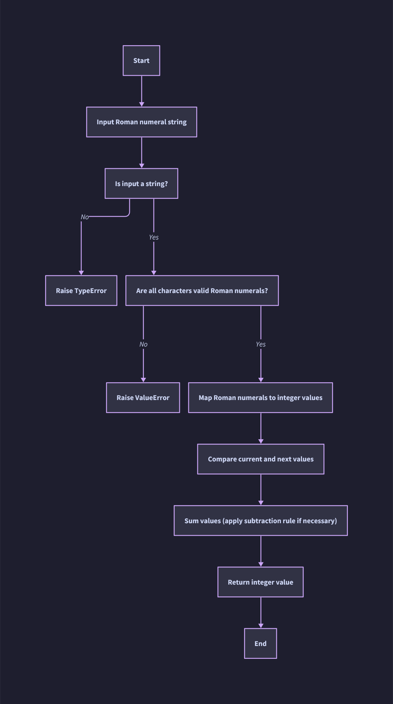

# Roman Numerals To Integer Convertor (FastAPI Version)

## Table of Contents

- [About](#about)
- [Getting Started](#getting_started)
- [Usage](#usage)
- [Algorithm Explaination](#algorithm)
- [Tasks](#tasks)
- [Git Convention](#git)

## About `<a name = "about"></a>`

This Project is a web API to convert the roman numerals to integer number through REST API implemented by **FastAPI**

## Getting Started `<a name = "getting_started"></a>`

These instructions will help you run the project on your local machine using Docker Compose.

### Prerequisites

1. Docker and Docker Compose

### Installing

use the following docker compose command to mange the app.

#### Environment Setup

To run the app:

- Description: Starts the application using Docker Compose.
- Command: `docker compose -f docker-compose.yaml up -d`

#### Build Commands

To build the docker image of app:

- Description: Builds the Docker images without using cache.
- Command: `docker compose -f docker-compose.yaml build --no-cache`

To remove the built image of app :

- Description: Removes the latest Docker image for the Roman Converter.
- Command: `docker image rm roman-conveter:latest`

#### Docker Management

To stop app:

- Description: Stops and removes containers, networks, volumes, and images created by `up`.
- Command: `docker compose -f docker-compose.yaml down -v`

To show the app container log:

- Description: Follows the logs of the running containers.
- Command: `docker compose -f docker-compose.yaml logs -f`

To show status of app contianer:

- Description: Lists all containers, including stopped ones.
- Command: `docker compose -f docker-compose.yaml ps -a`

## Usage `<a name = "usage"></a>`

### App Execution Flow

1. create .env file

```bash
cp env-example .env
```

2. build app image:

```bash
docker compose -f docker-compose.yaml build --no-cache
```

3. run app container:

```bash
docker compose -f docker-compose.yaml up -d
```

#### URL paths

convert endpoint

```bash
http://localhost:8080/api/v1/convert
```

swagger endpoint

```bash
http://localhost:8080/docs
```

redoc endpoint

```bash
http://localhost:8080/redoc
```

### Test Execution Flow

1. run docker-compose.test.yaml:
   ```bash
   docker compose -f docker-compose.yaml -f docker-compose.test.yaml up -d
   ```
2. run test script:

```bash
docker compose -f docker-compose.yaml -f docker-compose.test.yaml exec -it backend sh /app/scripts/run_tests.sh
```

on linux use `sudo` prefix for previous commands


# Project Structure Documentation

```bash
.
|-- docker
|   `-- Dockerfile                 # Specifies the environment to build a Docker image for the application.
|-- docs
|   `-- images
|       |-- flowchart.png          # A PNG image of a flowchart illustrating project structure or logic.
|       `-- flowchart.svg          # An SVG version of the flowchart for scaling purposes.
|-- scripts
|   `-- run_tests.sh               # A shell script to execute the test suite for the project.
|-- src
|   |-- conversion
|   |   |-- __init__.py            # Marks the directory as a Python package; initializes the package.
|   |   |-- dtos.py                # Contains Data Transfer Objects (DTOs) used in the application.
|   |   |-- exceptions.py          # Defines exceptions used in the conversion process.
|   |   |-- routers.py             # Defines API endpoint routes related to conversion functionality.
|   |   |-- services.py            # Contains business logic and services for the conversion module.
|   |   `-- value_objects.py       # Defines value objects, encapsulating domain-specific concepts.
|   `-- main.py                    # Main entry point of the application.
`-- tests
    |-- conversion
    |   |-- __init__.py            # Marks the directory as a Python package for test discovery.
    |   `-- test_convert_endpoint.py  # Contains unit tests for conversion API endpoints.
    `-- __init__.py                # Marks the directory as a Python package for test discovery.
|-- Makefile                       # Automates tasks and builds using make commands.
|-- README.md                      # Provides an overview of the project, setup instructions, and documentation.
|-- docker-compose.test.yaml       # Configuration for setting up a Docker environment for testing.
|-- docker-compose.yaml            # Configuration for setting up the main Docker environment.
|-- env-example                    # Example of environment variable settings; template for actual `.env` file.
|-- pyproject.toml                 # Configuration for Python project management and dependencies.
|-- requirements-dev.lock          # Locked versions of development dependencies for reproducibility.
|-- requirements.lock              # Locked versions of production dependencies for reproducibility.
|-- ruff.toml                      # Configuration for Ruff, a linting tool to enforce code quality.
```

## Algorithm Explaination `<a name = "algorithm"></a>`

### Flow Chart



code related to this flow are located in the following path:

```bash
src/conversion/value_objects.py (Validations) and src/conversion/services.py (Conversion)
```

#### Flow Explanation:

1. **Start**: The process begins with receiving the Roman numeral string as input.
2. **Validation**: The input is validated:
   - First, check if the input is a string (`Is input a string?`).
   - Then, ensure all characters are valid Roman numerals (`Are all characters valid Roman numerals?`).
3. **Conversion**: The valid Roman numeral string is mapped to integer values.
4. **Comparison and Summation**:
   - The current and next integer values are compared using the subtraction rule.
   - The final sum is calculated.
5. **Result**: The integer value is returned as the result.

#### Error Handling:

- If the input is not a string, a `TypeError` is raised.
- If the input contains invalid Roman numeral characters, a `ValueError` is raised.

## Tasks getting done `<a name = "tasks"></a>`

* [X] create project structure
* [X] install packages
* [X] conversion project
* [X] conversion service test
* [X] conversion api test
* [X] refactor project
* [X] readme doc
* [X] docker file
* [X] docker compoes
* [X] makefile commands
* [X] create github repository
* [X] ruff and pre-commit (Optional)

## Git Conventions `<a name = "git"></a>`

"Conventional Commits" guidelines:

Format: Each commit message should consist of three parts: a type, a scope, and a subject, separated by colons.

```git
<type>(<scope>): <subject>
```

***Type* **: The type describes the kind of change that was made. It should be one of the following:

- *feat*: A new feature
- *fix*: A bug fix
- *docs*: Documentation changes
- *style*: Changes to formatting or whitespace, no code changes
- *refactor*: Code refactor without any feature or bug fix
- *test*: Adding or updating tests
- *chore*: Updating build tasks, package manager configs, etc.
- *ops*: affect operational components like infrastructure, deployment, backup, recovery, ...

***Scope*** (optional) : The scope provides a hint at what part of the codebase the change affected. It's often omitted if the change is small or affects multiple parts of the codebase.

***Subject*** : The subject is a brief description of the change, written in the imperative mood (e.g. "Add" instead of "Added").
